# Снимки экрана

Снято **3 октября 2026** с живого локального стенда (`127.0.0.1:5173` + seed), Playwright Chromium, тёмная тема MIDNIGHT.

Это **не** фотографии физического телефона и **не** проверка камеры / пальца. Ширина: десктоп 1440×900, телефон 390×844.

Повторить:

```bash
cd frontend
node scripts/capture-docs-screenshots.mjs
```

Нужны запущенные UI и API и посеянные demo-данные. Ссылка QR на снимке ведёт на локальный origin стенда — в production будет `PUBLIC_APP_URL`.

Каталог поставщика на снимке содержит исторические seed-названия (`Phase9…`). Это демо-данные, не продуктовый ассортимент.

## Владелец

### Старт, десктоп

KPI дня, лента записей, CTA «Открыть расписание». Фон — teal-градиент только на этом экране.

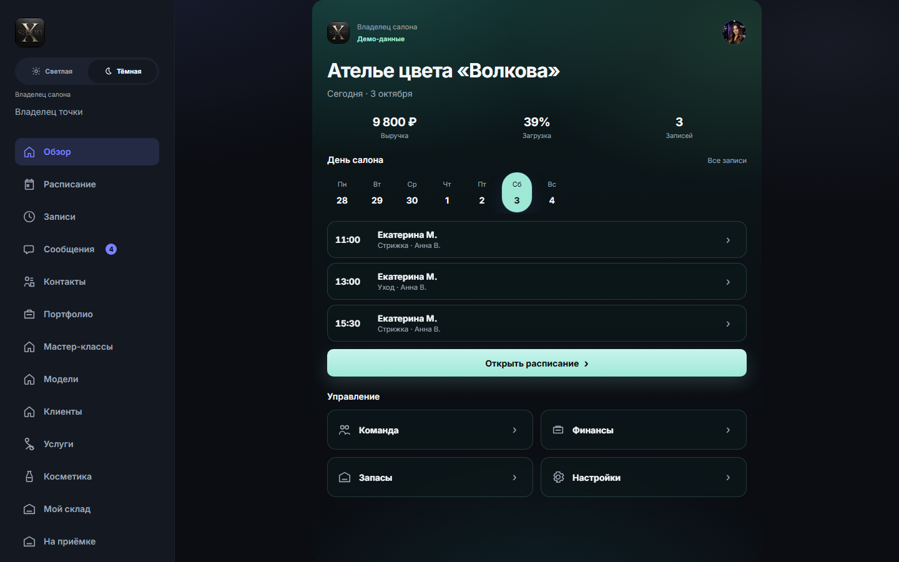

### Старт, телефон

Та же страница, нижняя навигация.

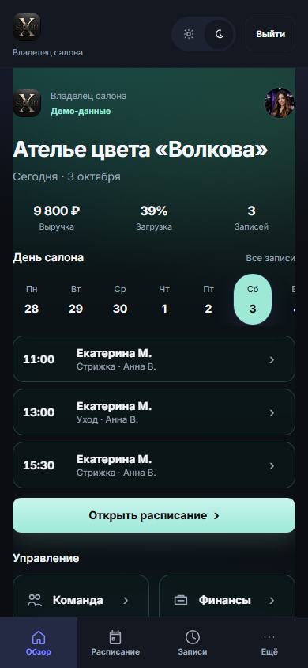

### Календарь, десктоп

Неделя FullCalendar, рабочие часы, записи и задачи.

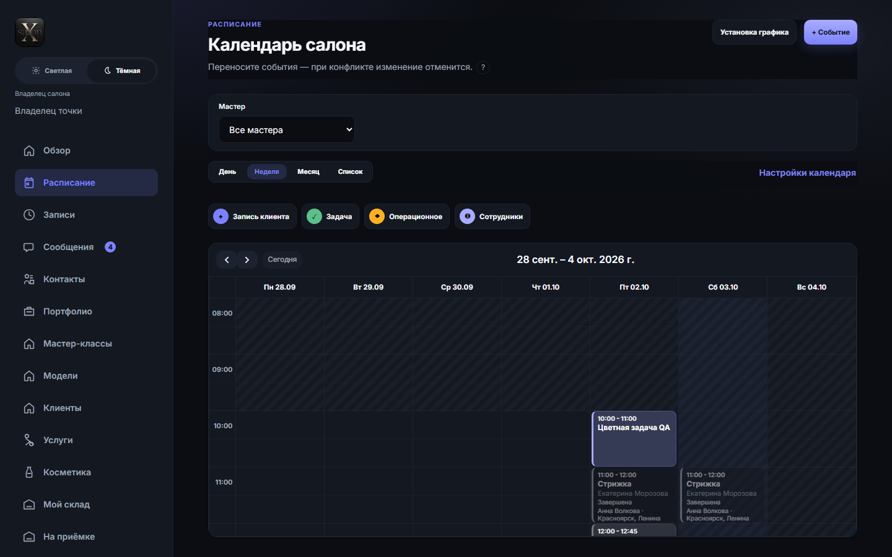

### Календарь, телефон

Вид «Список» на 390 px.

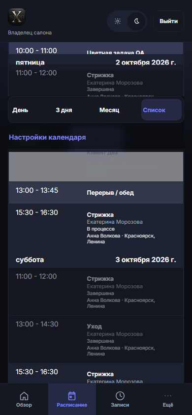

### Карточка записи

Клиент, услуга, статус, действия.

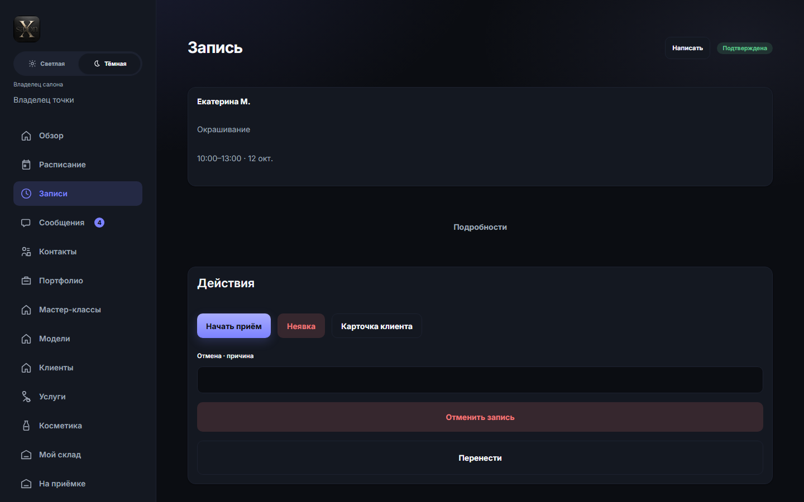

### Контакты

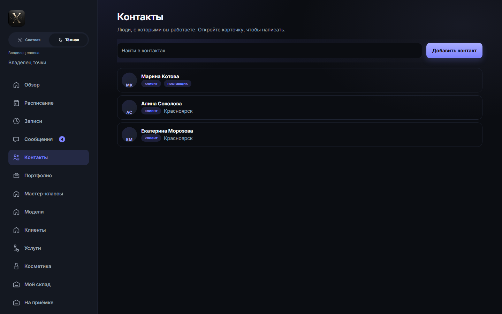

### Сообщения

Список диалогов владельца.

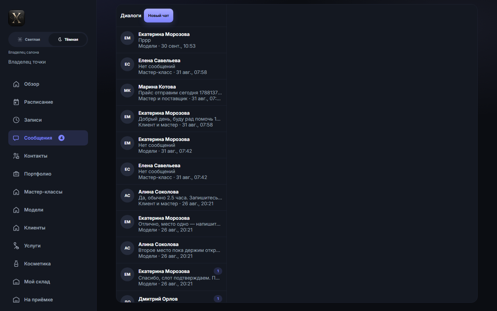

### QR-приглашение

Код и ссылка приглашения мастера. Камера телефона здесь не проверялась.

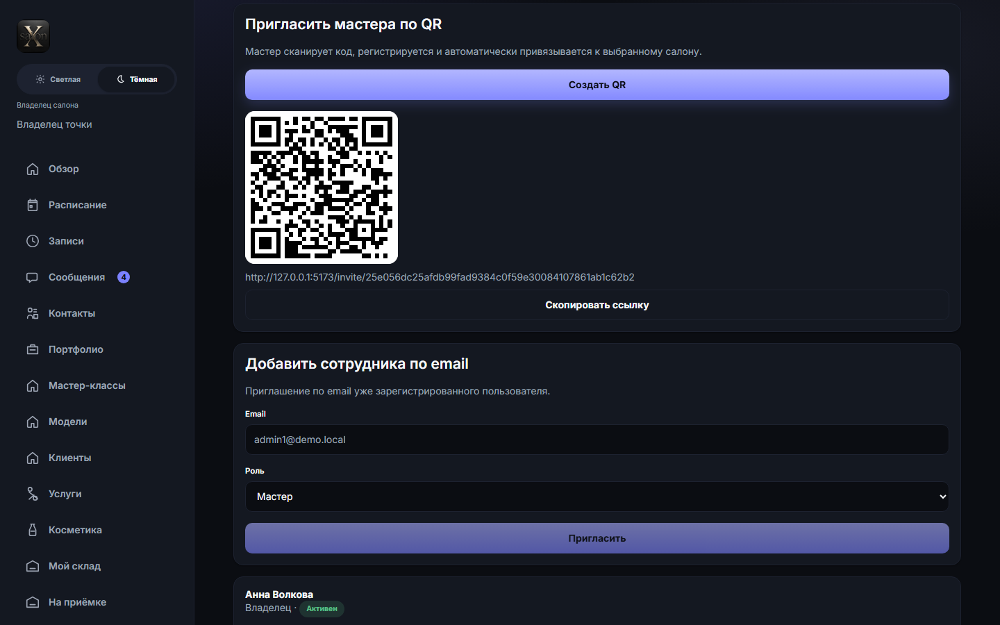

### Портфолио

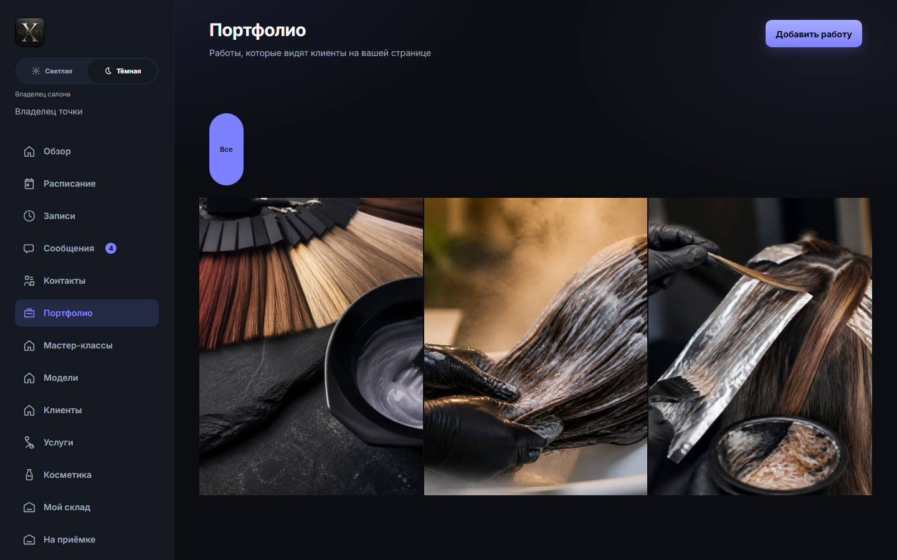

### Профиль и настройки мастера

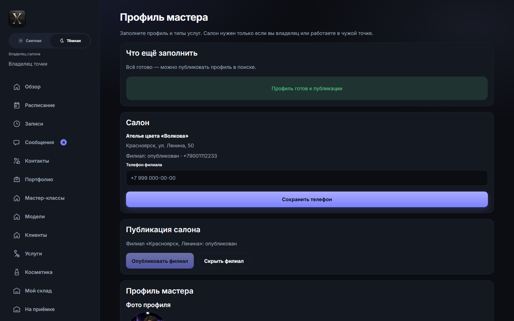

## Клиент

### Публичная страница мастера

Портфолио и блок записи (Екатерина смотрит Анну).

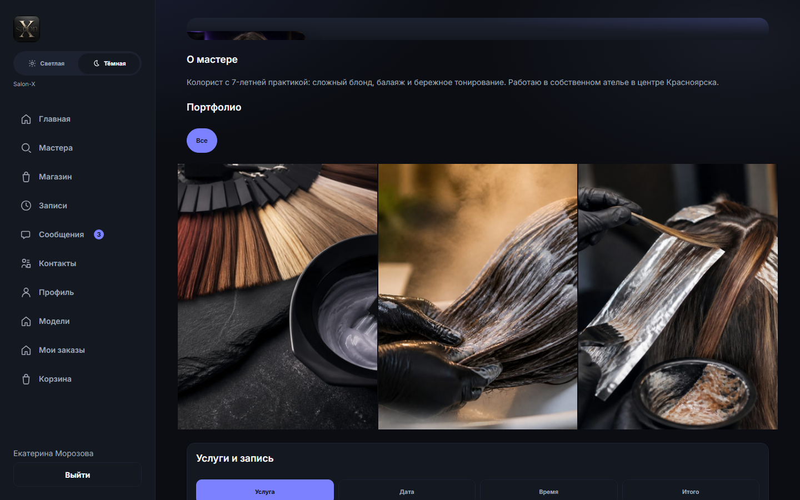

### Запись: выбор даты

После выбора услуги «Стрижка».

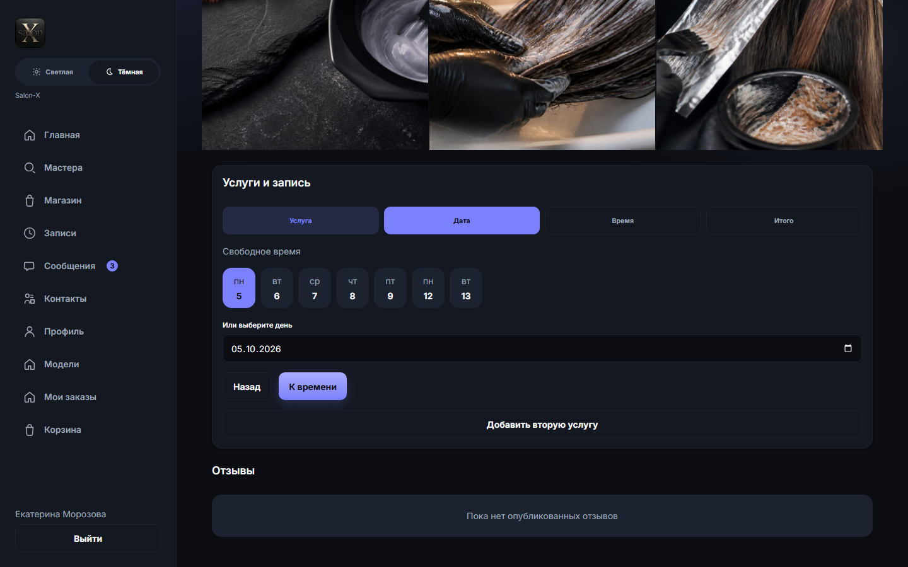

## Поставщик

### База знаний

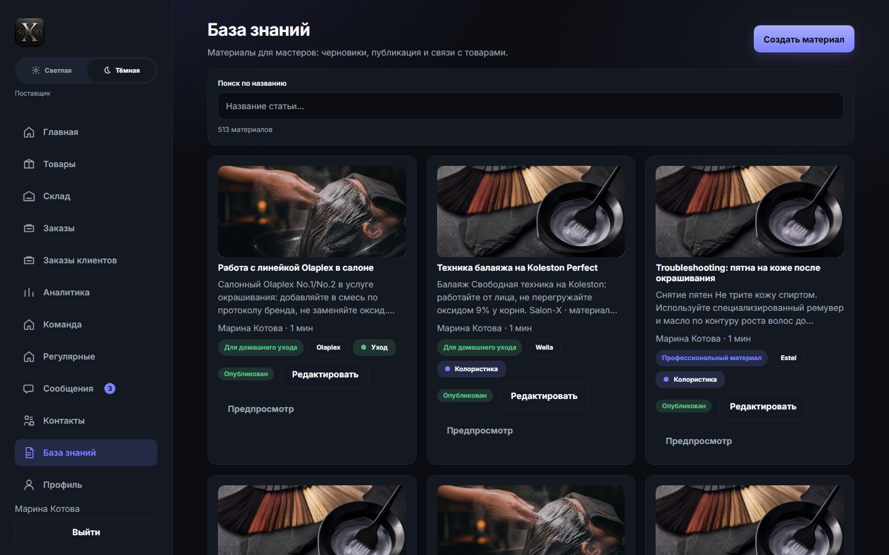

### Каталог

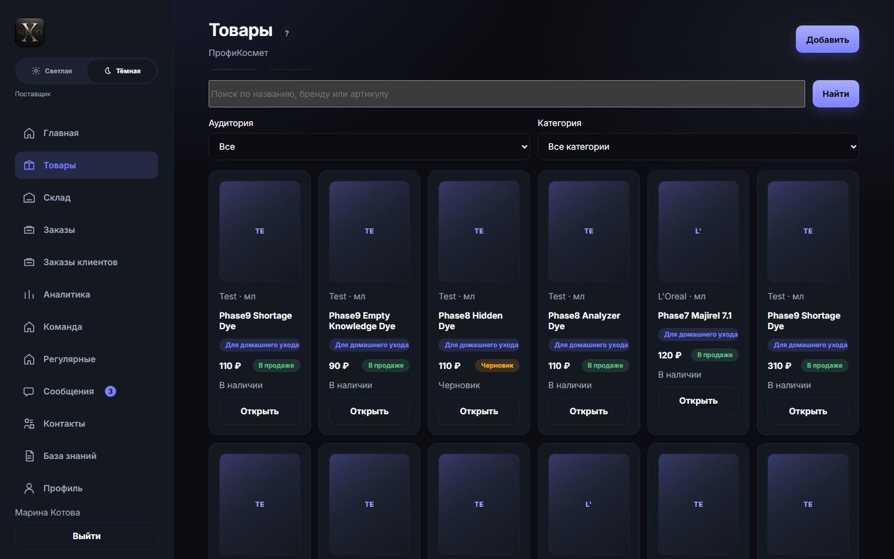
